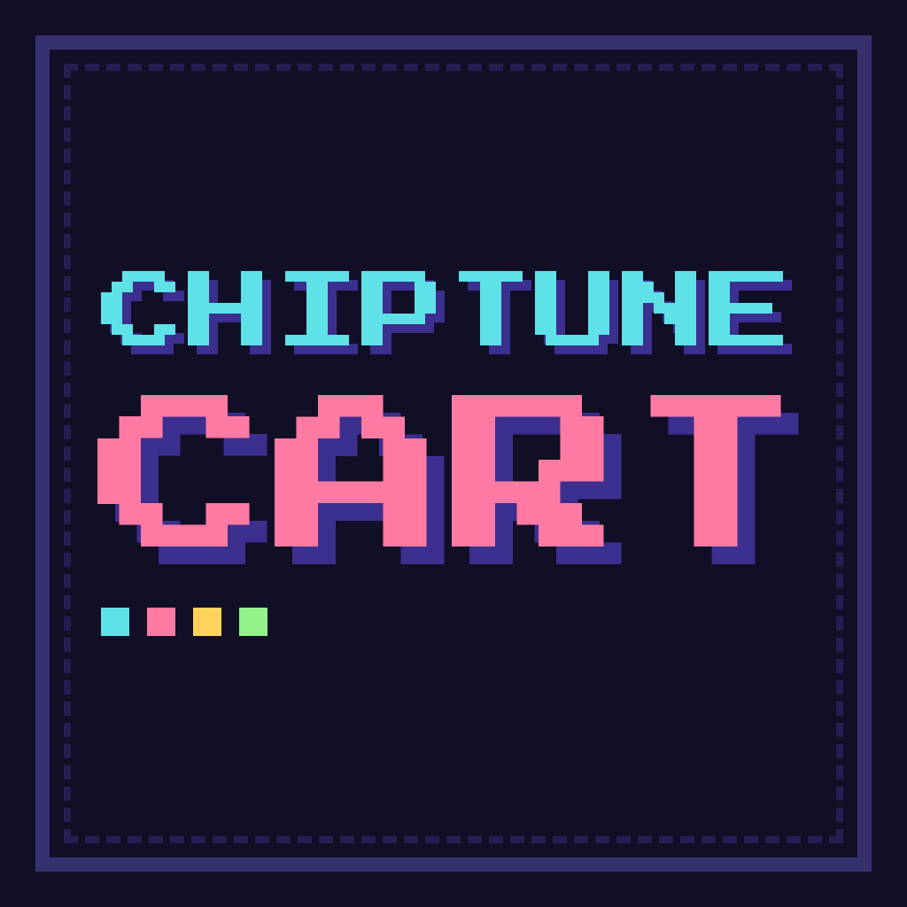
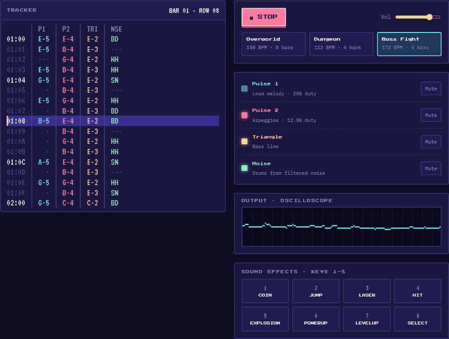
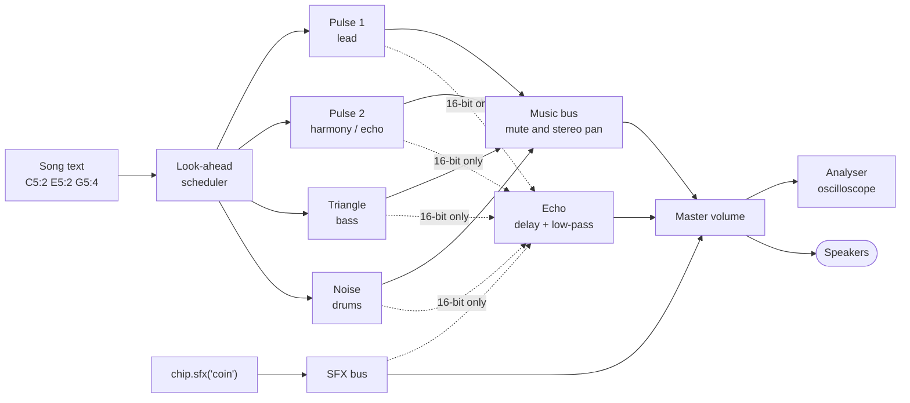
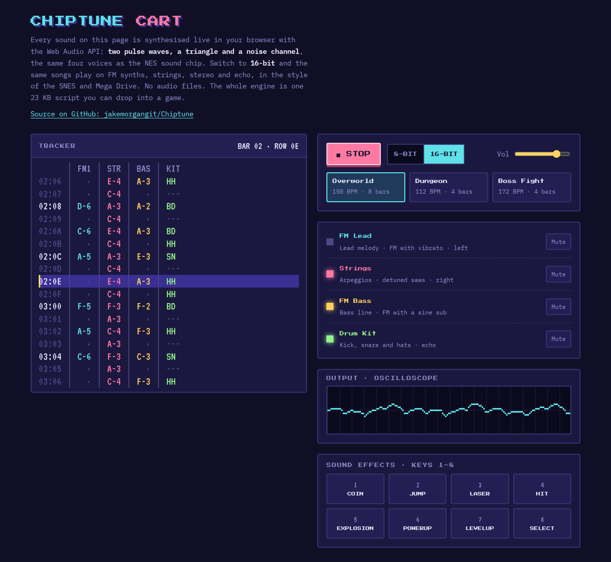

<p align="center"></p>

# Chiptune


A tiny retro music and sound-effect engine for browser games. Everything is synthesised
live with the Web Audio API: no audio files and no dependencies. Every song plays in two
styles, switchable live: **8-bit** like the NES, or **16-bit** like the SNES and Mega Drive.



Songs are written for four channels named after the NES sound chip. The mode decides how each one sounds:

| Channel | 8-bit | 16-bit | Typical use |
|---|---|---|---|
| `pulse1` | Square wave, 12.5 / 25 / 50 / 75% duty | Two-operator FM with vibrato, panned left | Lead melody |
| `pulse2` | Square wave | Detuned sawtooth strings, panned right | Harmony, arpeggios, echo |
| `triangle` | Triangle wave | FM bass with a sine sub | Bass |
| `noise` | Filtered noise drums | Fuller kit: sine kick, layered snare, crisp hats | Drums: `k` kick, `s` snare, `h` closed hat, `o` open hat, `c` crash |

8-bit is dry and mono. 16-bit adds stereo placement and a SNES-style echo (a filtered feedback
delay), and plays sound effects through a warmer filtered sawtooth.

## How it works

Each note is a short-lived oscillator or noise burst with its own volume envelope. A look-ahead
scheduler queues notes about 120 ms ahead of the audio clock, so timing stays tight even when the
game's main thread is busy.



## Demo

Open `index.html` in a browser. Press **Space** to play or stop, **M** to switch between 8-bit and
16-bit, and keys **1–8** for sound effects.
The page shows a tracker view of the song, per-channel mutes and a live oscilloscope.



## Use it in a game

```html
<script src="chiptune.js"></script>
<script>
  const chip = new ChipTune();

  // Browsers block audio until the player clicks or presses a key.
  startButton.onclick = () => {
    chip.unlock();
    chip.play(ChipTune.songs.overworld);
  };

  // In your game logic
  if (player.touches(coin)) chip.sfx('coin');
  if (boss.awake) chip.play(ChipTune.songs.boss);
  if (paused) chip.stop();

  // Switch sound style at any time, even mid-song
  chip.setMode('16bit');
</script>
```

### API

| Call | Does |
|---|---|
| `chip.unlock()` | Starts the audio context. Call it from a click or key handler. |
| `chip.play(song)` | Plays a song on loop, replacing any song already playing. |
| `chip.stop()` | Fades out and stops the music. |
| `chip.sfx(name)` | Plays a sound effect over the music. |
| `chip.setMode('8bit' \| '16bit')` | Switches the sound style. Takes effect on the next note. |
| `chip.setVolume(0..1)` | Sets the master volume. |
| `chip.setMuted(channel, bool)` | Mutes or unmutes one music channel. |
| `chip.onStep(fn)` | Calls `fn({ step, time, song })` for every sixteenth note, for syncing visuals. |

Included songs: `overworld`, `dungeon`, `boss`.
Included sound effects: `coin`, `jump`, `laser`, `hit`, `explosion`, `powerup`, `levelup`, `select`.

## Write your own song

One step is a sixteenth note. Pitched lines are `NOTE:steps` tokens with `r` for a rest.
Drum lines take one character per step, with `.` for silence. Shorter lines repeat to fill the song.

```js
const myTheme = {
  name: 'Title',
  bpm: 132,
  pulse1:   { duty: 0.25, vol: 0.15, line: 'C5:2 E5:2 G5:4 A5:2 G5:2 E5:4' },
  triangle: { vol: 0.3, line: 'C3:4 G2:4 A2:4 G2:4' },
  noise:    { vol: 0.3, line: 'k.h.s.h.k.h.s.hh' },
};
chip.play(myTheme);
```

Channel options: `vol`, `duty` (pulse only), `sustain` (0–1 level after the attack),
`gate` (fraction of each note that sounds) and `delay` (shift a line by N steps, handy for echoes).
`duty` only affects 8-bit mode; everything else applies to both.

## Limits

Browsers slow down timers in background tabs, so music can stutter while the tab is hidden.
